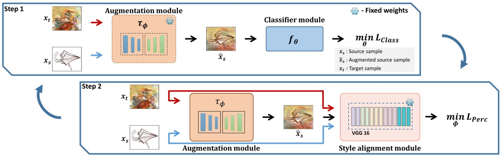

# Learnable Data Augmentation for Unsupervised Domain Adaptation (LearnAug-UDA)

## Introduction
This is the official implementation for our BMVC 2023 paper: [Learnable Data Augmentation for Unsupervised Domain Adaptation](https://arxiv.org/abs/2310.02201).



## Abstract

This paper presents a classification framework based on learnable data augmentation to tackle the One-Shot Unsupervised Domain Adaptation (OS-UDA) problem. OS-UDA is the most challenging setting in Domain Adaptation, as only one single unlabeled target sample is assumed to be available for model adaptation. Driven by such single sample, our method LearnAug-UDA learns how to augment source data, making it perceptually similar to the target. As a result, a classifier trained on such augmented data will generalize well for the target domain. To achieve this, wedesigned an encoder-decoder architecture that exploits a perceptual loss and style transfer strategies to augment the source data. Our method achieves state-of-the-art performance on two wellknown Domain Adaptation benchmarks, DomainNet and VisDA.

## Installation

Create a conda environment using the next command. Where <env> is the name given to the new environment.

```
    conda create --name <env> --file requirements.txt
```

### Datasets

Download [DomainNet](http://ai.bu.edu/M3SDA/).

Download [VisDAc](https://github.com/VisionLearningGroup/taskcv-2017-public/tree/master/classification).

The dataset directory should look like this:
```bash
├── dataset
    ├── xxx
        ├── labeled_source_images_xxx.txt
        ├── labeled_target_images_xxx_1.txt
        ├── labeled_target_images_xxx_3.txt
        ├── unlabeled_target_images_clipart_1.txt
        ├── unlabeled_target_images_xxx_3.txt
        ├── validation_target_images_xxx_3.txt
        ... xxx={clipart, painting, real, sketch}
    ├── VisDAc
        ├── test
        ├── train
        ├── validation
```

### Training

To train LearnAug-UDA, it is necessary to run main.py with the desired experiment configuration.

Training for Sketch (Source) to Painting (Target) using one target sample, the disentangled encoders (DE) with reconstruction loss (recLoss):

```
python3 main.py \
--source_dataset sketch \
--target_dataset painting \
--benchmark DomainNet \
--consider_content \
--vae_type DED \
--vis \
--batch_size 8 \
--target_batch_size 1 \
--style_weights 0.25,1.0,0.0 \
--content_weights 1.0,0.0 \
--recLoss \
--apply_rndCrop
```

Training for Sketch (Source) to Painting (Target) using one target sample, the shared encoder (SE):

```
python3 main.py \
--source_dataset sketch \
--target_dataset painting \
--benchmark DomainNet \
--consider_content \
--vae_type UNIT \
--vis \
--batch_size 8 \
--target_batch_size 1 \
--alpha 5.0 \
--beta 1.0 \
--style_weights 0.25,1.0,0.0 \
--content_weights 1.0,0.0 \
--apply_rndCrop
```


## Citing the paper
- If you find this code useful, please consider citing

```
@article{carrazco2023learnable,
  title={Learnable Data Augmentation for One-Shot Unsupervised Domain Adaptation},
  author={Carrazco, Julio Ivan Davila and Morerio, Pietro and Del Bue, Alessio and Murino, Vittorio},
  journal={arXiv preprint arXiv:2310.02201},
  year={2023}
}
```

## Acknowledgment

Our code builds upon the following code publicly available, and thank the following repos for providing helpful components/functions in our work.

- [TeachAugment](https://github.com/DensoITLab/TeachAugment)